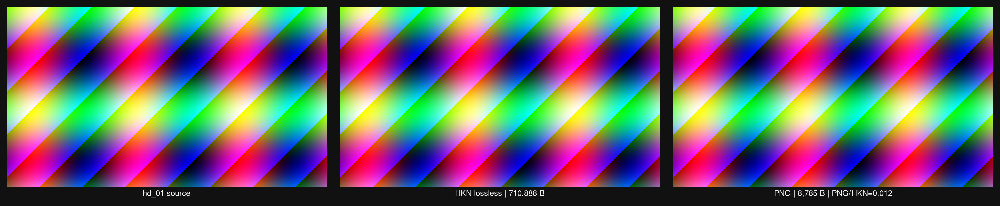

# HakoNyans

[English](README.md) | [日本語](README.ja.md)

HakoNyans は、実用的なデコード速度とモジュール設計（箱理論）を重視した実験的画像コーデックです。UI・アニメ・写真の各カテゴリで、圧縮率と速度のバランス改善を進めています。

## 特徴
- `NyANS-P` を中核にした並列志向のエントロピー設計
- SIMD 実装と相性の良いブロック処理（AAN IDCT、軽量予測器）
- ロスレス向けハイブリッドモード: `Copy` / `Palette` / `Filter`
- 設計境界が明確で、ベンチ・論文再現資産をリポジトリ内で管理

## 現在の注力点
- ロッシーのサイズ/画質トレードオフ改善（CfL 調整、帯域モデル強化）
- ロスレス写真カテゴリの改善（予測器・モード選択最適化）
- 圧縮率を上げつつデコード遅延を安定維持

## Dev Challenge スナップショット（ロスレス）




## ビルド
```bash
mkdir -p build
cd build
cmake -DCMAKE_BUILD_TYPE=Release ..
cmake --build . -j
```

## CLI
```bash
# エンコード (PPM -> HKN)
./hakonyans encode input.ppm output.hkn [quality]

# ロスレスエンコード (PPM -> HKN, preset: fast|balanced|max)
./hakonyans encode-lossless input.ppm output.hkn [preset]

# デコード (HKN -> PPM)
./hakonyans decode input.hkn output.ppm

# ストリーム情報表示
./hakonyans info input.hkn
```

## ベンチマーク / 再現
- ベンチ本体は `bench/` にあります。
- 論文向け再現スクリプトと生成物は `paper/repro/` と `paper/results/` にあります。
- 比較時は同一画像セットで次を揃えるのを推奨します。
  - ファイルサイズ
  - デコード時間（`ms`）
  - 画質指標（`PSNR`、`SSIM`、必要に応じて `MS-SSIM`）

## ディレクトリ構成
```text
src/            codec, entropy, SIMD, platform 実装
bench/          ベンチマーク実行ファイル/測定ツール
tests/          単体/統合テスト
docs/           実装メモ、各フェーズ指示書
paper/          論文ソース、スクリプト、表、結果資産
```

## Contact
- X (Twitter): https://x.com/CharmNexusCore

## ライセンス
MIT License
